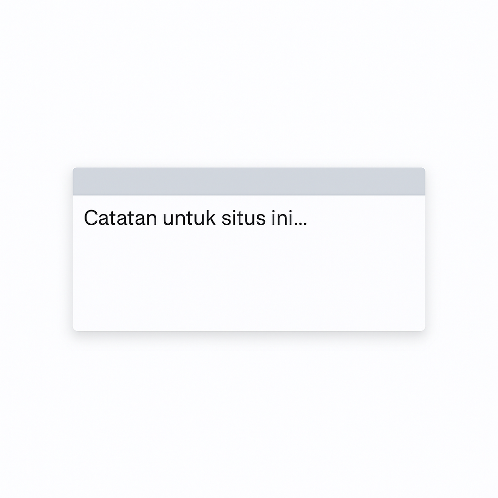

# 📝 Minimalist Notes – Chrome Extension V 1.0 (Beta)

Ekstensi Chrome ringan untuk membuat catatan cepat langsung di halaman web mana pun. Cocok untuk mencatat ide, to-do list, atau highlight saat browsing — tanpa meninggalkan halaman.

---

## 🚀 Fitur Utama

- 🗒️ **Tulis catatan langsung di halaman web**
- 🖱️ **Drag bar abu-abu** untuk memindahkan posisi catatan
- 🔍 **Textarea dapat di-resize**
- ⌨️ **Shortcut keyboard: `Alt + N`** untuk menampilkan/menyembunyikan note
- 💾 **Catatan tersimpan otomatis per situs**
- 🌐 **Mendukung penyimpanan di `chrome.storage.sync`**

---

## 🧪 Cara Install (Secara Lokal)

1. Download atau clone repositori ini.
2. Buka Google Chrome dan buka tab `chrome://extensions/`
3. Aktifkan **Developer Mode** (kanan atas).
4. Klik tombol **Load unpacked**.
5. Pilih folder proyek ini.
6. Ekstensi siap digunakan!

---

## ⌨️ Shortcut

| Tombol                          | Fungsi                        |
|-------------------------------|-------------------------------|
|          `Alt` + `N`          | Tampilkan/sembunyikan note   |

---

## 🖼️ Tampilan

  
*Tampilan minimalis dan dapat dipindahkan ke mana saja.*

---

## 📁 Struktur Proyek

minimalist-notes/ ├── manifest.json # Konfigurasi ekstensi ├── injectNoteBox.js # Script utama ├── icons/ │ └── icon128.png # Ikon ekstensi ├── preview.png # Cuplikan layar (opsional) └── README.md # Dokumentasi ini

---

## 📃 Lisensi

MIT License  
Copyright © 2025  
Dibuat oleh [Hidieo Riz'n](https://www.linkedin.com/in/hidieo-rizn)

---

## 📌 Catatan Tambahan

- Note dapat dipindahkan dengan drag bar berwarna abu-abu di atas textarea.
- Drag bar secara otomatis menyesuaikan ukuran dengan textarea.
- Penyimpanan catatan bersifat per domain, dan tersinkron antar perangkat jika login Chrome.

---

Selamat mencatat tanpa ribet! ✨
